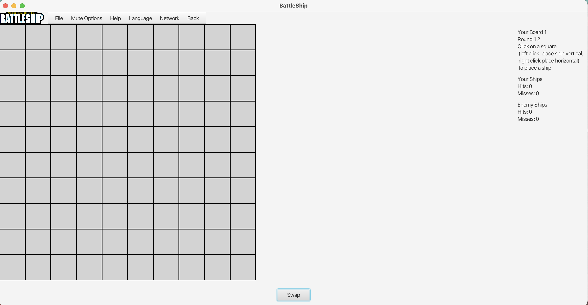
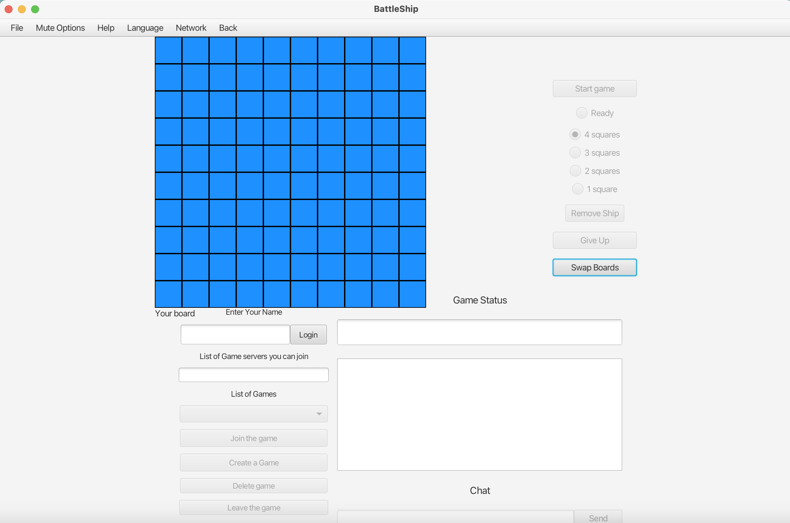

# BattleShipZ

BattleShipZ is a Battleship game developed using JavaFX. Engage in classic naval warfare with options to play against a bot or another player.

# Screenshots







## Project Features

- **Player vs Bot**: Test your skills against an AI opponent.
- **Player vs Player**: Connect through a server to play against another human player.
- **Swap Button**: Easily switch views between your board and the enemy's board, or modify the layout to display both boards side by side.
- **In-Game Messaging**: Communicate with your opponent during the game.
- **Game Stats**: Track your wins, losses, and other stats.
- **Sound Effects**: Enjoy immersive game sounds, including background music, shooting, misses, wins, and losses.

## How to Run the Game

### Option 1: Run the JAR File

1. **Download the JAR file**.
2. **Run the JAR file** in your command line:

   ```bash
   java --module-path "/path/to/javafx-sdk-22.0.1/lib" --add-modules javafx.controls,javafx.fxml -jar JAPLabsSwing.jar
   ```

   Replace `/path/to/javafx-sdk-22.0.1/lib` with the actual path to your JavaFX SDK.

### Option 2: Build from Source

1. **Clone the repository**:

   ```bash
   git clone https://github.com/Ruun/BattleShipZ.git
   ```

2. **Navigate to the project directory**:

   ```bash
   cd BattleShipZ
   ```

3. **Use Maven to clean and build the project**:

   ```bash
   mvn clean package
   ```

4. **Run the generated JAR file**:

   ```bash
   java --module-path "/path/to/javafx-sdk-22.0.1/lib" --add-modules javafx.controls,javafx.fxml -jar target/BattleShipZ-1.0-SNAPSHOT.jar
   ```

## Credits

The server-side implementation is largely based on [this repository](https://github.com/JMazur121/Battleship).

